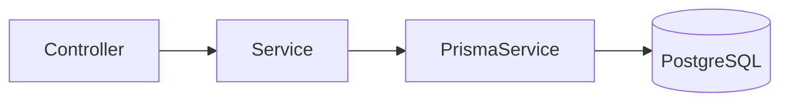
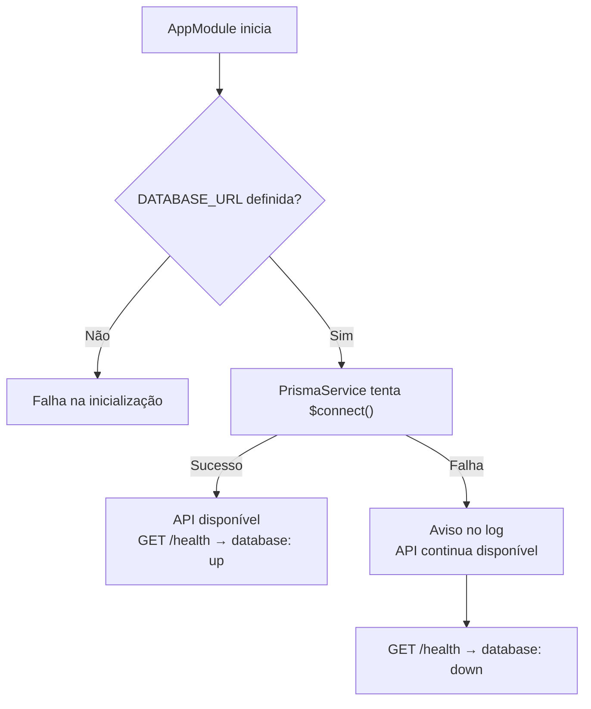

# Fundação do Backend

Este documento descreve a base técnica sobre a qual os módulos da API são construídos: o que já existe, onde cada peça vive e como adicionar um novo recurso.

Nenhuma regra de negócio do MVP está implementada. A fundação entrega bootstrap, configuração global, acesso ao banco via Prisma, formato único de erros e o endpoint `GET /health`.

---

# Estrutura do repositório

```text
backend/
├── prisma/
│   └── schema.prisma         # configuração do Prisma (sem entidades ainda)
├── prisma.config.ts          # URL de conexão (Prisma 7)
├── generated/prisma/         # Prisma Client gerado (não versionado)
├── src/
│   ├── main.ts               # bootstrap: CORS, ValidationPipe, filtro de exceções
│   ├── app.module.ts         # módulo raiz
│   ├── common/
│   │   └── filters/          # formato único de erro da API
│   ├── prisma/               # PrismaService global
│   └── health/               # GET /health
├── docker-compose.yml        # PostgreSQL local
├── .env.example              # variáveis de ambiente de referência
└── docs/                     # documentação desta aplicação
```

---

# Arquitetura interna

Cada recurso da API segue a separação **Controller → Service → Prisma**, conforme [`07-arquitetura.md`](../../../frontend/docs/07-arquitetura.md).



| Camada | Responsabilidade | Não deve |
| ------ | ---------------- | -------- |
| **Controller** | Rotas HTTP, status codes, delegar ao Service | Conter regra de negócio ou acessar o Prisma diretamente |
| **Service** | Regras de negócio, orquestração, validações de domínio | Conhecer detalhes de HTTP (Request/Response) |
| **PrismaService** | Acesso ao banco via Prisma Client | Conter regra de negócio |

DTOs com `class-validator` ficam na camada do módulo (próximos ao Controller) e são validados pelo `ValidationPipe` global.

---

# Bootstrap (`main.ts`)

O `main.ts` configura comportamentos globais da API:

| Configuração | Comportamento |
| ------------ | ------------- |
| **CORS** | Lê `CORS_ORIGIN`. Valor `*` ou ausente libera todas as origens. Valores separados por vírgula restringem às origens informadas. |
| **ValidationPipe** | `whitelist`, `forbidNonWhitelisted` e `transform` em todos os DTOs. |
| **AllExceptionsFilter** | Padroniza o corpo de toda resposta de erro. |
| **PORT** | Porta de escuta. Padrão `3000`. |

---

# Formato de erro

Toda falha responde no mesmo formato, conforme [`09-api.md`](../../../frontend/docs/09-api.md):

```json
{
  "statusCode": 404,
  "error": "Not Found",
  "message": "Cannot GET /nao-existe",
  "path": "/nao-existe",
  "timestamp": "2026-08-30T01:21:08.299Z"
}
```

Erros de validação (`400`) incluem `message` como array de strings.

Erros inesperados respondem `500` com mensagem genérica (`"Erro interno do servidor."`). Detalhes internos ficam apenas no log — nunca na resposta.

---

# Banco de dados (Prisma 7)

O Otzar utiliza o **Prisma ORM 7** com adaptador `@prisma/adapter-pg`. A decisão de não adotar `prisma@8` está documentada em [`08-stack-tecnologica.md`](../../../frontend/docs/08-stack-tecnologica.md).

## Configuração

* A URL de conexão fica em `prisma.config.ts`, não no bloco `datasource` do schema.
* O `PrismaClient` é instanciado em `PrismaService` com o adaptador a partir de `DATABASE_URL`.
* O client gerado fica em `generated/prisma/` e **não é versionado**.

## Comportamento na inicialização



A API sobe mesmo com o banco indisponível para não bloquear o desenvolvimento do frontend. O estado real da conexão é exposto por `GET /health`.

Uma `DATABASE_URL` ausente, por outro lado, impede a inicialização — o `ConfigService` exige a variável.

## Comandos

```powershell
npm run prisma:generate   # gera o Prisma Client
npm run prisma:migrate    # aplica migrations (quando existirem entidades)
npm run prisma:studio     # interface visual do banco
```

Após clonar o repositório e a cada alteração do schema, executar `prisma:generate`.

---

# Módulos existentes

## PrismaModule

Módulo global que exporta `PrismaService` para injeção em qualquer Service.

## HealthModule

Expõe `GET /health` para diagnóstico da API e da conexão com o banco. Contrato detalhado em [`endpoints/health.md`](../endpoints/health.md).

---

# Como adicionar um novo módulo

1. Definir ou estender entidades em `prisma/schema.prisma`, conforme [`03-modelo-de-dados.md`](../../../frontend/docs/03-modelo-de-dados.md).
2. Executar `npm run prisma:generate` e `npm run prisma:migrate`.
3. Criar a pasta `src/<recurso>/` com:
   * `<recurso>.module.ts`
   * `<recurso>.controller.ts`
   * `<recurso>.service.ts`
   * DTOs em `dto/` com decorators do `class-validator`
4. Registrar o módulo em `app.module.ts`.
5. Documentar endpoints em `backend/docs/endpoints/<recurso>.md`.
6. Implementar as regras de [`04-regras-de-negocio.md`](../../../frontend/docs/04-regras-de-negocio.md) no Service — o backend é a única fonte de verdade.

No frontend, criar a Feature equivalente conforme [`13-fundacao.md`](../../../frontend/docs/13-fundacao.md).

---

# Fora da fundação

Não fazem parte desta etapa e serão implementados junto com os módulos de domínio:

* Autenticação, JWT e guards de autorização;
* Entidades do domínio no schema do Prisma;
* Endpoints de Projetos, Tarefas, Tickets, Documentos e demais recursos;
* Deploy no Render com `DATABASE_URL` apontando para o Neon.
