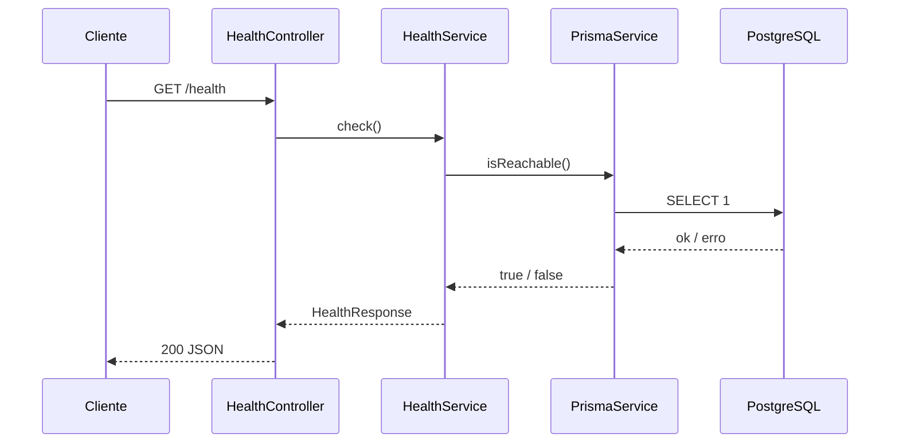

# GET /health

Endpoint de diagnóstico da API e da conexão com o banco de dados.

Utilizado pela tela de diagnóstico do frontend (`/diagnostico`) para validar o ambiente de desenvolvimento.

---

# Requisição

```http
GET /health
```

Sem autenticação. Sem corpo. Sem parâmetros.

---

# Resposta de sucesso

**Status HTTP:** `200 OK`

**Corpo:**

```json
{
  "status": "ok",
  "database": "up",
  "timestamp": "2026-08-30T01:31:33.796Z"
}
```

| Campo | Tipo | Descrição |
| ----- | ---- | --------- |
| `status` | `"ok"` | A API está em execução. |
| `database` | `"up"` \| `"down"` | Estado da conexão com o PostgreSQL no momento da consulta. |
| `timestamp` | `string` (ISO 8601) | Momento da verificação. |

## `database: "down"`

Ocorre quando o PostgreSQL está indisponível ou a conexão falhou. A API continua respondendo — apenas o campo `database` indica a falha.

Causas comuns em desenvolvimento:

* Container Docker não iniciado (`docker compose up -d`).
* `DATABASE_URL` incorreta.
* PostgreSQL local não instalado ou parado.

---

# Implementação



Arquivos:

* `src/health/health.controller.ts`
* `src/health/health.service.ts`
* `src/health/health.types.ts`
