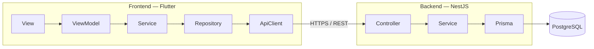
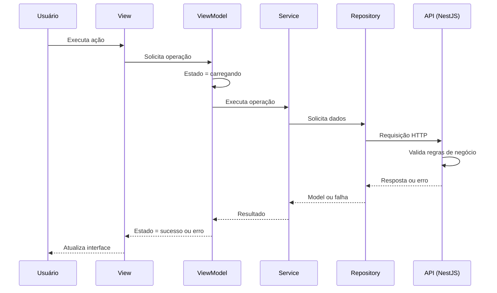

# Arquitetura

O Otzar é composto por um **frontend Flutter** (Web e mobile) e um **backend NestJS** que expõe uma API REST. As duas aplicações são independentes e se comunicam apenas por HTTPS.

O frontend adota **MVVM + Service + Repository**, com foco em separação de responsabilidades, testabilidade e simplicidade.



---

# Camadas do frontend

| Camada         | Responsabilidade                                              | Não deve                                                  |
| -------------- | ------------------------------------------------------------- | --------------------------------------------------------- |
| **View**       | Interface e interação do usuário                              | Conter lógica de negócio, HTTP ou acesso ao Repository    |
| **ViewModel**  | Estado da tela, ações do usuário, loading/sucesso/erro        | Conter regra de negócio ou chamar o ApiClient             |
| **Service**    | Orquestrar a operação e aplicar validações de interface        | Redefinir regras de negócio do domínio                    |
| **Repository** | Acesso aos dados e tradução das respostas da API em Models     | Conter regra de negócio                                   |
| **ApiClient**  | Infraestrutura HTTP, cabeçalhos, autenticação e erros de rede  | Conhecer telas, ViewModels ou entidades específicas       |

O fluxo de dependências é unidirecional. Uma camada só conhece a camada imediatamente abaixo dela.

```text
View → ViewModel → Service → Repository → ApiClient → REST API
```

A View nunca acessa diretamente Repository, ApiClient ou qualquer serviço de infraestrutura.

A organização física dessas camadas em pastas está definida em `.cursor/rules/flutter-estrutura-do-projeto.mdc`.

---

# Onde ficam as regras de negócio

O **backend é a única fonte de verdade das regras de negócio**. Toda validação que protege a integridade do domínio é implementada e aplicada no NestJS.

O frontend não é uma barreira de segurança: qualquer cliente pode chamar a API diretamente, e a interface pode estar desatualizada em relação ao backend.

## Backend

* Aplica todas as regras descritas em `04-regras-de-negocio.md`.
* Valida os dados recebidos, independentemente do que o frontend enviou.
* Rejeita operações inválidas com código HTTP e mensagem apropriados.
* É o único responsável por garantir unicidade, integridade referencial e transições de estado válidas.

## Frontend

A camada `domain/services` do Flutter **não redefine regras de negócio**. Ela existe para:

* Orquestrar chamadas a um ou mais Repositories em uma única operação de tela.
* Traduzir os erros de negócio devolvidos pela API em estados que a ViewModel consegue exibir.
* Reproduzir, na interface, restrições **já definidas pelo backend**, apenas para dar retorno imediato ao usuário (campo obrigatório, formato inválido, ação indisponível no estado atual).

Essa reprodução é uma conveniência de usabilidade, nunca uma decisão. Se a regra existe no frontend, ela existe porque o backend a define — e o backend continua validando.

## Regra prática

> Uma validação só pode existir no frontend se o backend também a aplicar.

Se uma regra precisa mudar, ela muda primeiro no backend e em `04-regras-de-negocio.md`. O frontend acompanha.

Nunca implementar no Flutter uma regra que o backend não conheça, e nunca confiar no frontend para impedir uma operação inválida.

---

# Fluxo de uma operação



Quando o backend rejeita uma operação, o erro sobe pelas mesmas camadas até virar um estado de erro exibível. O frontend não tenta contornar nem reinterpretar a decisão do backend.

---

# Estado e injeção de dependências

O gerenciamento de estado e a injeção de dependências utilizam **Riverpod**.

* A ViewModel expõe o estado da tela para a View.
* Services, Repositories e o ApiClient são injetados por Providers.
* Providers não concentram regra de negócio.

Toda tela deve tratar explicitamente os estados de **carregando**, **vazio**, **sucesso** e **erro**.

---

# Testes

A separação em camadas existe para permitir testar o comportamento sem a interface.

Prioridade de testes no frontend:

* Services e ViewModels.
* Repositories que possuam lógica de tradução relevante.

As regras de negócio são testadas no backend, onde são efetivamente aplicadas.

---

# Documentos relacionados

* `arquitetura/fundacao.md` — o que a fundação já implementa e como conectar uma nova Feature.
* `.cursor/rules/flutter-arquitetura.mdc` — padrões de implementação da arquitetura no código Dart.
* `.cursor/rules/flutter-estrutura-do-projeto.mdc` — organização das pastas e arquivos.
* `04-regras-de-negocio.md` — regras aplicadas pelo backend.
* `08-stack-tecnologica.md` — tecnologias, hospedagem e comunicação.
* `09-api.md` — princípios e padrões da API REST.
