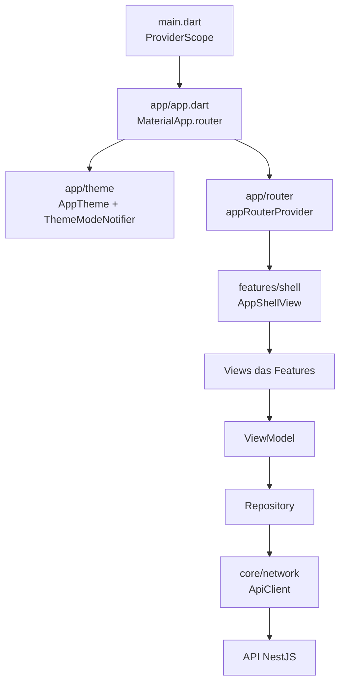
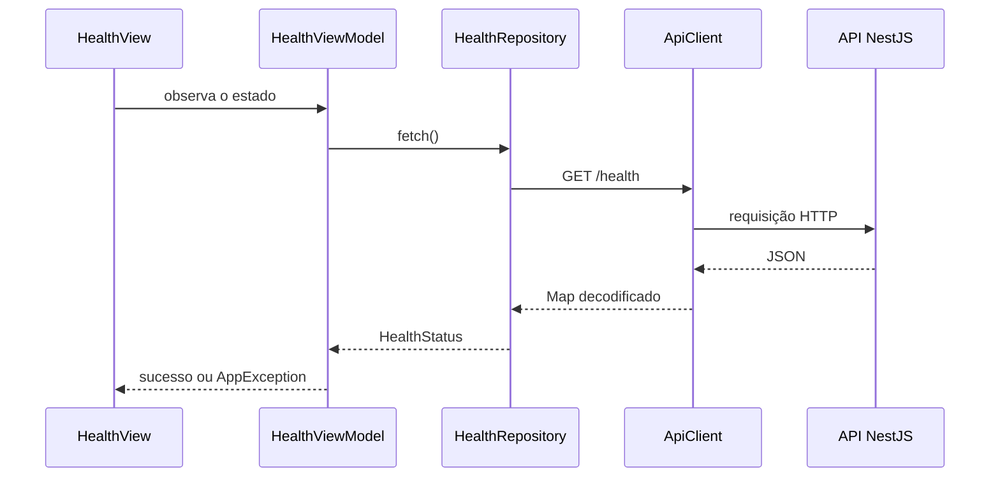

# Fundação da Aplicação

Este documento descreve a base técnica sobre a qual as Features do Otzar são construídas: o que já existe, onde cada peça vive e como conectar uma nova funcionalidade.

Nenhuma regra de negócio do MVP está implementada. A fundação entrega apenas a estrutura, o tema, a navegação, a infraestrutura HTTP e a verificação de conexão entre frontend e API.

---

# Repositório

```text
C:\GitHub\Otzar\
├── frontend\   # Frontend Flutter
└── backend\    # API REST NestJS
```

---

# Frontend

## Componentes



## Arquivos principais

| Arquivo                                        | Responsabilidade                                                       |
| ---------------------------------------------- | ---------------------------------------------------------------------- |
| `lib/main.dart`                                 | Apenas o bootstrap: `ProviderScope` e `runApp`.                        |
| `lib/app/app.dart`                              | `MaterialApp.router`, temas e roteador.                                |
| `lib/app/theme/app_colors.dart`                 | Cor semente da identidade visual.                                      |
| `lib/app/theme/app_theme.dart`                  | Temas claro e escuro do Material 3.                                    |
| `lib/app/theme/theme_mode_notifier.dart`        | Preferência de tema, persistida em `shared_preferences`.               |
| `lib/app/router/app_routes.dart`                | Caminhos das rotas.                                                    |
| `lib/app/router/app_router.dart`                | Configuração do GoRouter.                                              |
| `lib/core/config/app_config.dart`               | Configuração do ambiente, lida de `--dart-define`.                     |
| `lib/core/network/api_client.dart`              | Transporte HTTP e tradução de erros.                                   |
| `lib/core/errors/app_exception.dart`            | Falhas conhecidas da aplicação.                                        |
| `lib/core/widgets/`                             | Estados de carregando, vazio e erro.                                   |
| `lib/features/shell/`                           | Barra superior e navegação principal.                                  |
| `lib/features/health/`                          | Verificação de conexão com a API.                                      |

## Tema

O esquema de cores claro e escuro está definido em `AppColors`, exportado do Material Theme Builder (paleta neutra em tons de cinza). A tipografia usa a fonte **Inter** via `google_fonts`, montada em `app_text_theme.dart`.

Para trocar a identidade visual, substitua `AppColors.lightScheme()` e `AppColors.darkScheme()` por uma nova paleta exportada do Material Theme Builder. As Features nunca escrevem cores diretamente: obtêm tudo de `Theme.of(context)`.

A preferência entre tema claro e escuro é alternada pela barra superior e persistida localmente.

## Navegação

A navegação usa `ShellRoute`: a barra superior e a navegação principal permanecem montadas enquanto o conteúdo da rota muda.

O layout se adapta à largura da janela:

| Largura   | Navegação                                     |
| --------- | --------------------------------------------- |
| `< 840`   | `NavigationDrawer` aberto pela barra superior  |
| `>= 840`  | `NavigationRail` recolhido                     |
| `>= 1200` | `NavigationRail` estendido, com rótulos        |

Os itens da navegação principal seguem `06-ui-ux.md`: Projetos, Tarefas, Backlog e Base de Conhecimento. As telas dessas rotas ainda são provisórias (`SectionPlaceholderView`).

O redirecionamento para o login será configurado em `appRouterProvider` quando a Feature de Autenticação existir.

## Comunicação com a API

O endereço da API não fica fixo no código:

```powershell
flutter run -d chrome --dart-define=API_URL=http://localhost:3000
```

Sem o parâmetro, `AppConfig.apiUrl` assume `http://localhost:3000`.

O `ApiClient` conhece apenas transporte. Ele converte qualquer falha em uma `AppException`:

| Falha                                   | Exceção                        |
| --------------------------------------- | ------------------------------ |
| Sem conexão, servidor fora do ar, timeout | `NetworkException`             |
| A API respondeu com erro                 | `ApiException` (com `statusCode`) |
| A API respondeu conteúdo inválido        | `UnexpectedResponseException`  |

A mensagem da `ApiException` vem do campo `message` devolvido pelo backend, de modo que a interface exibe o texto definido pela API.

Os Repositories traduzem o JSON em Models. As ViewModels expõem `AsyncValue` e as Views tratam carregando, sucesso e erro com os widgets de `core/widgets`.

## Diagnóstico

O ícone de diagnóstico na barra superior abre `/diagnostico`, que consulta `GET /health` percorrendo o caminho real da arquitetura:



Esta tela existe para validar o ambiente e serve como exemplo mínimo do fluxo entre camadas.

---

# Backend

A fundação do backend (bootstrap, Prisma, formato de erros, `GET /health` e como adicionar módulos) está documentada em [`backend/docs/arquitetura/fundacao.md`](../../backend/docs/arquitetura/fundacao.md).

O ambiente de desenvolvimento do backend está em [`backend/docs/ambiente-de-desenvolvimento.md`](../../backend/docs/ambiente-de-desenvolvimento.md).

---

# Como adicionar uma nova Feature

1. Criar a pasta em `lib/features/<feature>/` seguindo `.cursor/rules/flutter-estrutura-do-projeto.mdc`.
2. Criar o Model em `data/models/` com Freezed e rodar `dart run build_runner build`.
3. Criar o Repository em `data/repositories/`, injetando `apiClientProvider`.
4. Criar o Service em `domain/services/` **apenas quando houver orquestração real** entre Repositories. A Feature de diagnóstico não possui Service porque não há o que orquestrar.
5. Criar a ViewModel em `presentation/view_models/` expondo `AsyncValue`.
6. Criar a View em `presentation/views/`, tratando carregando, vazio, sucesso e erro.
7. Registrar a rota em `app/router/app_routes.dart` e `app/router/app_router.dart`, substituindo a `SectionPlaceholderView` correspondente.
8. Criar o módulo equivalente no backend, conforme [`backend/docs/arquitetura/fundacao.md`](../../backend/docs/arquitetura/fundacao.md).

O backend continua sendo a única fonte de verdade das regras de negócio, conforme `07-arquitetura.md`.

---

# Fora da fundação

Não fazem parte desta etapa e serão implementados junto com as Features:

* Autenticação, JWT e rotas protegidas;
* Entidades do domínio no schema do Prisma;
* Telas reais de Projetos, Tarefas, Backlog e Base de Conhecimento;
* Visualização Kanban;
* Deploy no Render.
