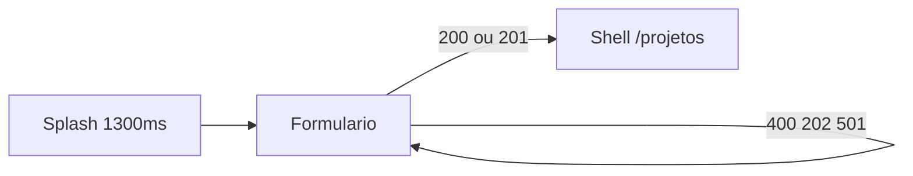

# Autenticação

Jornada visual de entrada do Otzar. O acesso real à API (JWT, OAuth) ainda não existe: e-mail, senha e os botões sociais passam por stubs locais.

A sessão fica só em memória. Não há token e nada é gravado no dispositivo. Ao encerrar o processo, o usuário volta para o login.

---

# Jornada

1. **Splash.** A palavra “Otzar” é escrita em 1,30 s (`Curves.easeOutCubic`), só a marca, no tema escuro. A palavra completa permanece até o fim desse intervalo. Em seguida as mesmas letras deslizam, em cerca de 400 ms, até o lugar da marca no painel: à esquerda quando a largura é de pelo menos 900 px e para cima quando é menor. O formulário aparece junto com esse movimento.
2. **Formulário.** Três modos na mesma rota `/login`: login, criar conta e recuperar senha.
3. **Shell.** Status `200` ou `201` permanece visível por 500 ms. A sessão é gravada e o GoRouter faz um fade de 250 ms até `/projetos`.

O tema escuro vale só para esta jornada. O shell continua respeitando a preferência de tema do usuário.

---

# Layout

O corte é `AppBreakpoints.medium` (900px).

| Largura | Disposição |
| ------- | ---------- |
| `>= 900` | Metade esquerda: marca ou código. Metade direita: formulário. Divisória fina. |
| `< 900` | Faixa superior com a animação (cerca de 32% da altura, entre 150 e 220px) e formulário abaixo. |

No estado padrão o formulário cabe na viewport. O scroll aparece quando o teclado reduz a área útil.

---

# Formulário

| Modo | Título | Campos | Ação | Links |
| ---- | ------ | ------ | ---- | ----- |
| Login | Bem-vindo | E-mail e senha | Entrar | Esqueci minha senha, Criar conta |
| Criar conta | Criar conta | E-mail e senha | Criar conta | Já tenho conta |
| Recuperar senha | Recuperar senha | E-mail | Enviar | Voltar ao login |

Login e criar conta também mostram Google, Facebook e GitHub. São botões ligados a `SocialAuthProvider`, sem OAuth.

---

# Painel de código

Com os dois campos vazios e sem resultado, “Otzar” pulsa em escala e opacidade baixas.

Enquanto há texto, o pulso sai de cena e o painel revela o snippet JavaScript:

- E-mail avança a primeira metade (até o `fetch`), na proporção `tamanho / 15`, limitada a 1.
- Senha avança a segunda metade (do `if (!res.ok)` até `// status:`), na proporção `tamanho / 5`, limitada a 1, enquanto o campo está em foco.
- Ao sair do campo de senha, se ela tiver mais de 3 caracteres, a segunda metade é revelada por inteiro. Editar a senha de novo retoma o avanço proporcional ao tamanho.
- As metades são independentes. Apagar recua o trecho correspondente.
- Ao surgir o código, o nome “Otzar” se desloca, em cerca de 400 ms, do centro do painel para acima do snippet, diminuindo e atenuando. Volta ao centro quando os campos ficam vazios e não há status.
- Quando o painel é mais baixo que o snippet, a rolagem acompanha a última linha, para a metade da senha e o `// status:` continuarem visíveis.

O único feedback de erro ou sucesso é a linha `// status:`. Não há SnackBar, toast nem banner.

| Situação | Status | Efeito |
| -------- | ------ | ------ |
| E-mail com `@` e senha não vazia | 200 | Entra no shell |
| Criar conta com os mesmos critérios | 201 | Entra no shell |
| E-mail sem `@`, ou senha vazia | 400 | Permanece na tela |
| Recuperar senha com e-mail válido | 202 | Permanece na tela |
| Google, Facebook ou GitHub | 501 | Permanece na tela |

E-mail e senha são considerados depois de `trim`.

---

# Onde plugar a API

`AuthProvider.signIn()` é o contrato. Hoje a tela usa `EmailPasswordAuthProvider` e `SocialAuthProvider`. Uma implementação real substitui esses stubs e devolve `AuthResult` com o status HTTP e, quando houver acesso, a `AuthSession`.

O redirect está em `appRouterProvider`: sem sessão, as rotas do shell voltam para `/login`; com sessão, `/login` vai para `/projetos`.
