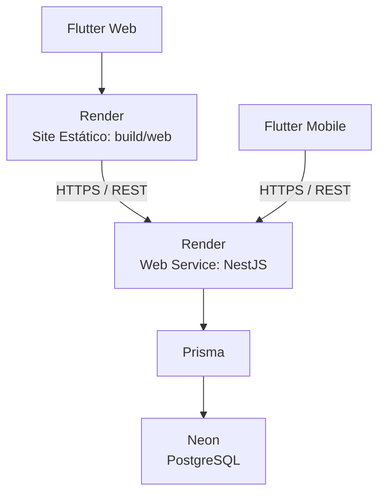
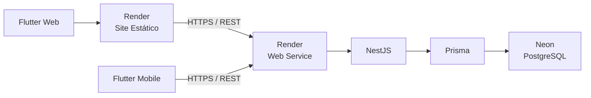

# Stack Tecnológica

## Visão Geral

O Otzar utiliza uma arquitetura multiplataforma baseada em **Flutter no frontend**, **NestJS no backend**, **Prisma como ORM** e **PostgreSQL como banco de dados**.

Para hospedagem, o **Flutter Web** e o **backend NestJS** serão executados no **Render**, e o banco de dados será hospedado no **Neon**.

O Render concentra as duas aplicações no mesmo painel: o frontend como **Site Estático** e o backend como **Web Service**.



### Arquitetura

```text
Flutter Web
  │
  └── Render (Site Estático)
        │
        │ HTTPS / REST
        ▼
      Render (Web Service)
        │
        └── NestJS
              │
              └── Prisma
                    │
                    ▼
                Neon PostgreSQL
```

Os aplicativos móveis Flutter não são hospedados: consomem diretamente a mesma API do NestJS via HTTPS.

---

# 🎨 Frontend — Flutter

**Tecnologia:** Flutter
**Linguagem:** Dart

O Flutter será utilizado para desenvolver a interface do Otzar para **Web e dispositivos móveis a partir de uma única base de código**.

### Motivos da escolha

* Código compartilhado entre Web, Android e iOS.
* Desenvolvimento rápido de interfaces.
* Componentes visuais nativos do Flutter.
* Bom desempenho.
* Ecossistema consolidado.
* Integração direta com Dart.
* Permite manter uma única arquitetura de frontend para diferentes plataformas.

A utilização de uma única base de código reduz a duplicação de funcionalidades e facilita a manutenção do sistema.

---

# ⚙️ Backend — NestJS

**Tecnologia:** NestJS
**Linguagem:** TypeScript
**Runtime:** Node.js

O NestJS será responsável pelo backend do Otzar e fornecerá a API REST consumida pelo Flutter.

### Responsabilidades

* API REST;
* Autenticação e autorização;
* Regras de negócio;
* Validação de dados;
* Controle de acesso;
* Integração com banco de dados;
* Integração com serviços externos;
* Processamentos no servidor.

### Motivos da escolha

* Arquitetura modular.
* Excelente suporte a TypeScript.
* Estrutura adequada para aplicações de médio e grande porte.
* Injeção de dependência.
* Facilidade para separar Controllers, Services e outras responsabilidades.
* Bom suporte para APIs REST.
* Ecossistema consolidado no Node.js.

A arquitetura do backend deverá priorizar separação de responsabilidades e facilidade de manutenção.

---

# 🗄️ ORM — Prisma

**Tecnologia:** Prisma ORM

O Prisma será utilizado como camada de acesso ao banco de dados entre o NestJS e o PostgreSQL.

```text
NestJS
   │
   ▼
Prisma
   │
   ▼
PostgreSQL
```

### Responsabilidades

* Acesso ao banco de dados;
* Consultas;
* Inserções;
* Atualizações;
* Exclusões;
* Tipagem das entidades;
* Migrations;
* Geração do Prisma Client.

### Motivos da escolha

* Integração com TypeScript.
* Tipagem forte.
* Autocomplete durante o desenvolvimento.
* Redução de erros em consultas.
* Sistema de migrations.
* Integração adequada com PostgreSQL.
* Boa integração com NestJS.

O Prisma deverá permanecer concentrado na camada de acesso a dados, evitando que Controllers ou outras camadas da aplicação acessem o banco diretamente.

### Versão adotada

O Otzar utiliza o **Prisma ORM 7**, versão mais recente do ORM. Os três pacotes são fixados em `^7.10.0`:

```text
prisma               # CLI do ORM
@prisma/client       # runtime consultado pela aplicação
@prisma/adapter-pg   # driver adapter do PostgreSQL
```

A partir da versão 7, o ORM exige a URL de conexão em `prisma.config.ts` e um driver adapter passado ao `PrismaClient`. A `url` deixou de ser aceita no bloco `datasource` do schema.

### Por que não a versão 8

O pacote `prisma@8` **não é uma versão mais nova do ORM**: é o CLI da **Prisma Developer Platform**, um produto distinto, voltado a autenticação, projetos, buckets, deploy e ao banco gerenciado Prisma Postgres. Nele o ORM passa a ser o subcomando `prisma orm`, que inicializa projetos no modelo "Prisma Next".

A versão 8 não foi adotada porque:

* Não existe `@prisma/client` nem `@prisma/adapter-pg` na versão 8. O runtime consumido pela aplicação só existe até a 7.10.0.
* O CLI 8 não expõe `generate` nem `migrate` no nível principal, quebrando os scripts `prisma:generate` e `prisma:migrate` do backend.
* A versão publicada é *release candidate*, não estável.
* A plataforma é orientada ao Prisma Postgres, enquanto o Otzar hospeda o banco no **Neon** e a aplicação no **Render**.

O CLI 8 é publicado sob a tag `latest` do npm. Por isso os pacotes são fixados explicitamente em `^7.10.0`: um `npm install` sem restrição instala o CLI da plataforma e quebra a geração do Prisma Client.

Essa decisão deve ser reavaliada quando o `@prisma/client` na versão 8 for publicado como estável.

---

# 🐘 Banco de Dados — PostgreSQL

**Tecnologia:** PostgreSQL

O PostgreSQL será o banco de dados relacional do Otzar.

### Motivos da escolha

* Banco de dados relacional maduro e consolidado.
* Código aberto.
* Excelente suporte a relacionamentos.
* Integridade referencial.
* Transações.
* Índices e consultas avançadas.
* Grande adoção pela comunidade.
* Compatibilidade com Prisma.
* Facilidade de migração entre provedores de hospedagem.

O PostgreSQL será utilizado para armazenar os dados persistentes do sistema, incluindo usuários, projetos, clientes, tarefas, sprints e demais entidades do Otzar.

---

# 🌐 Hospedagem do Frontend Web — Render (Site Estático)

**Plataforma:** Render
**Tipo de serviço:** Site Estático

O build do Flutter Web (`build/web`) será publicado como **Site Estático no Render**, no mesmo painel do backend.

```text
Internet
   │
   ▼
Render — Site Estático
   │
   └── build/web (Flutter Web)
```

### Motivos da escolha

* Mesma plataforma do backend, reduzindo o número de contas e painéis.
* Deploy integrado ao Git.
* HTTPS e domínio próprio.
* Site estático gratuito, adequado ao MVP.
* Não exige administração de servidor web (NGINX, Apache ou similares).

### Configuração

O ambiente de build do Render **não possui o SDK do Flutter pré-instalado**. Por isso, o `Build Command` instala o SDK antes de gerar o build.

* **Build Command:** `./scripts/render-build.sh`
* **Publish Directory:** `build/web`
* **Rewrite (SPA):** `/*` → `/index.html`

O script `scripts/render-build.sh`, versionado no repositório, baixa o canal `stable` do Flutter e executa o build. O passo a passo e o conteúdo do script estão em `12-ambiente-de-desenvolvimento.md`.

Essa opção foi escolhida em vez de gerar o build localmente porque mantém o deploy automático a partir do Git e evita versionar a pasta `build/web`.

O Site Estático serve apenas arquivos. Nenhuma regra de negócio ou credencial de banco deve existir nesta camada.

---

# ☁️ Hospedagem do Backend — Render (Web Service)

**Plataforma:** Render
**Tipo de serviço:** Web Service

O Render será utilizado para hospedar o backend NestJS.

```text
Internet
   │
   ▼
Render — Web Service
   │
   └── NestJS
```

### Motivos da escolha

* Configuração simplificada.
* Deploy integrado ao Git.
* Suporte a aplicações Node.js/NestJS.
* HTTPS.
* Variáveis de ambiente.
* Logs da aplicação.
* Health checks.
* Possibilidade de escalar posteriormente.
* Permite começar com baixo custo.

A utilização do Render reduz a necessidade de administrar manualmente servidores e infraestrutura.

---

# 🐘 Hospedagem do Banco — Neon

**Plataforma:** Neon
**Banco:** PostgreSQL

O PostgreSQL será hospedado no Neon.

```text
NestJS
   │
 Prisma
   │
   ▼
Neon
   │
PostgreSQL
```

### Motivos da escolha

* PostgreSQL totalmente gerenciado.
* Plano gratuito adequado para desenvolvimento e MVP.
* Não exige administração manual do servidor de banco.
* Escalabilidade.
* Backups e recursos de gerenciamento oferecidos pela plataforma.
* Integração simples através da `DATABASE_URL`.
* Compatibilidade com Prisma.

O Neon foi escolhido inicialmente visando **reduzir o custo de desenvolvimento e validação do MVP**, mantendo PostgreSQL como banco principal.

---

# 🔐 Comunicação

A comunicação entre Flutter e backend será realizada através de **HTTPS**.

```text
Flutter (Site Estático no Render / App Mobile)
   │
   │ HTTPS
   ▼
NestJS (Web Service no Render)
   │
   │ Prisma
   ▼
PostgreSQL (Neon)
```

O Site Estático e o Web Service são serviços distintos, com domínios distintos. O backend deve permitir a origem do frontend por meio de configuração de CORS.

O frontend não deverá acessar diretamente o banco de dados.

Toda operação que envolva dados persistentes deverá passar pela API do NestJS.

---

# 🔑 Variáveis de Ambiente

Informações sensíveis ou específicas do ambiente não devem ser armazenadas diretamente no código-fonte.

Exemplos:

```env
DATABASE_URL=
JWT_SECRET=
API_URL=
```

As variáveis deverão ser configuradas de acordo com o ambiente:

```text
Desenvolvimento
        ↓
Homologação
        ↓
Produção
```

Credenciais, tokens, senhas e chaves privadas **não devem ser versionados no Git**.

---

# 📦 Resumo da Stack

| Camada             | Tecnologia       | Função                               |
| ------------------ | ---------------- | ------------------------------------ |
| Frontend           | **Flutter**      | Interface Web e Mobile               |
| Linguagem Frontend | **Dart**         | Desenvolvimento Flutter              |
| Comunicação        | **HTTPS / REST** | Comunicação entre frontend e backend |
| Backend            | **NestJS**       | API e regras de negócio              |
| Linguagem Backend  | **TypeScript**   | Desenvolvimento do backend           |
| ORM                | **Prisma**       | Acesso ao banco e migrations         |
| Banco de dados     | **PostgreSQL**   | Persistência dos dados               |
| Hospedagem Frontend| **Render**       | Site Estático com o `build/web`      |
| Hospedagem Backend | **Render**       | Web Service com o NestJS             |
| Hospedagem Banco   | **Neon**         | PostgreSQL gerenciado                |

---

# 🏗️ Arquitetura Final



### Responsabilidade de cada camada

```text
Flutter
→ Interface e experiência do usuário

HTTPS / REST
→ Comunicação entre frontend e backend

NestJS
→ API, autenticação e regras de negócio

Prisma
→ Acesso e gerenciamento das operações no banco

PostgreSQL
→ Persistência dos dados

Render — Site Estático
→ Hospedagem do Flutter Web (build/web)

Render — Web Service
→ Hospedagem e execução do backend

Neon
→ Hospedagem e gerenciamento do PostgreSQL
```

---

# 💰 Estratégia Inicial de Custos

A infraestrutura foi escolhida inicialmente visando permitir o desenvolvimento e validação do MVP com **baixo custo, priorizando os planos gratuitos disponíveis**.

```text
Render — Site Estático (Flutter Web)
   ↓
Render — Web Service (NestJS)
   ↓
Prisma — ORM
   ↓
Neon — PostgreSQL
```

Nos planos gratuitos, o Web Service do Render hiberna após período de inatividade e o compute do Neon é suspenso quando ocioso. A primeira requisição após a ociosidade é mais lenta. O Site Estático não hiberna.

Quando o tempo de resposta passar a atrapalhar o uso diário, o primeiro investimento deve ser um plano pago do **Web Service**, sem alterar frontend, ORM ou banco.

Conforme o Otzar crescer, os serviços poderão ser migrados ou atualizados individualmente sem necessidade de alterar a arquitetura principal da aplicação.

A separação entre **NestJS, Prisma e PostgreSQL** também permite trocar o provedor de hospedagem do banco ou do backend sem alterar a responsabilidade dessas camadas.
